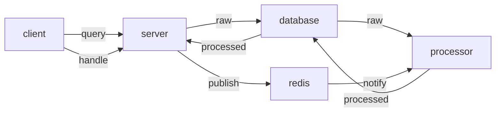
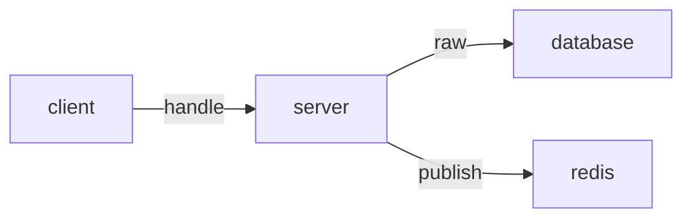
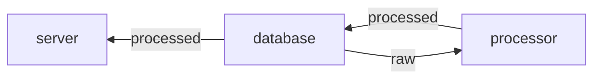
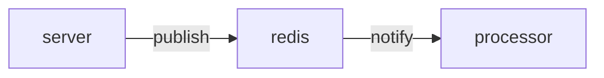

# 圖生圖的訂單查詢系統

收到訂單後，給用戶一個號碼牌，之後用戶再以號碼牌來查詢處理後的訂單。
這是一個有訂單查詢功能的ai圖生圖服務，輸入圖片，回傳一個查詢url。
等一段時間後，再透過這個查詢url，得到圖生圖的結果。

## 架構

~~這流程圖好糟糕~~


## 部署

從git上clone程式下來

```bash
git clone https://github.com/dopamine333/query_system_for_img2img.git
```

以requirements.txt下載python所需套件

```bash        
pip install -r requirements.txt
```
去`config.json`設定你的postgerSQL資料庫和redis的連線資訊

                        
```json
{
    "api_url":"http://127.0.0.1:5000",
    "img2img_url":"https://ai.jd-chie.store/discord_draw_img2img",

    "app_run_debug_mode":true,

    "raw_images_folder":"./raw_images",

    "dbname":"postgres",
    "dbuser":"postgres",
    "dbpass":"mysecretpassword",
    "dbhost":"localhost",

    "redis_host":"localhost",
    "redis_raw_cache":"raw_cache"
}
```

## 使用api

### handle

輸入base64的圖片，回傳查詢query_url
`route:/handle, method:POST`

```json
payload:{
     "init_image": "AAANSUhE...AA4aywgU",(base64)
}
response: {
     "query_url": "http://127.0.0.1:5000/query/order_id"
}
```

### query

輸入查詢query_url，回傳處理後的圖片的連結url
`route:/query/<order_id>, method:GET`

```json
response:{
    "processed": "https://s3.amazonaws.com/processed/order_id.png"
}
```


---





